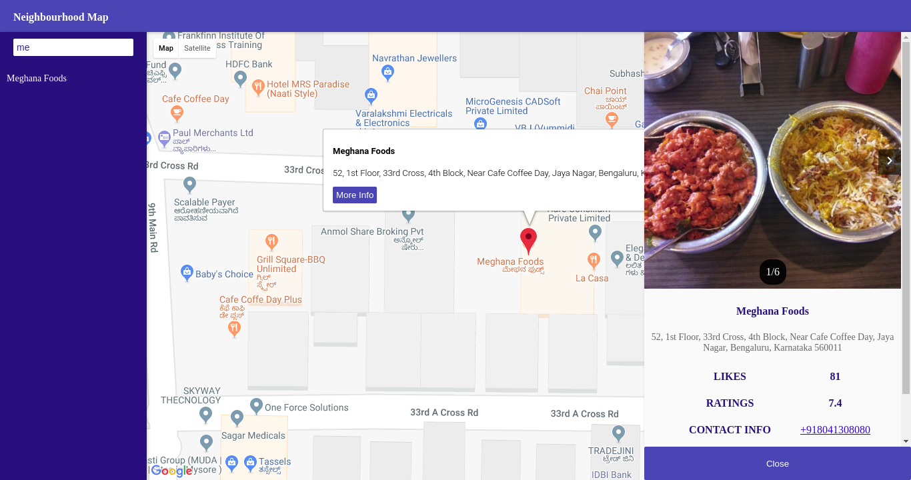
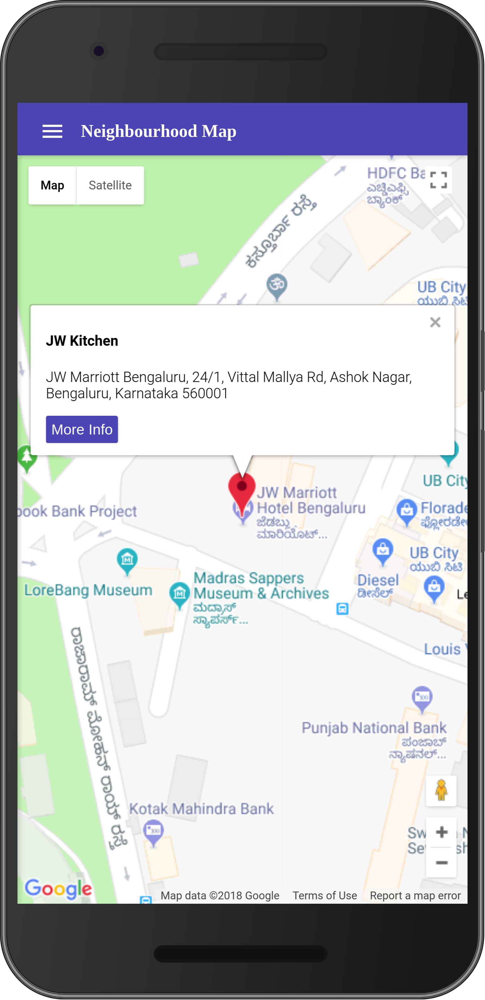

# Neighbourhood-map
This is the fifth project for udacity full stack nanodegree in this project we have to develop an web application using knockout.js. It will show places from my neighbourhood. We can filter those places and also know more about the places.
Used Google Map's API and foursquare API for map data and information about Restaurant respectively.

### How to run the code
1. Clone or download this repo.
1. change directory using ``` cd Neighbourhood-map ```
1. Run using ``` npm run start ```
4. Project is running in [http://localhost:5000](http://localhost:5000)

### Dependencies while building project
1. Uglify-es can be installed by ```sudo npm install -g uglify-es ```
1. Uglify Css can be installed by ```sudo npm install -g uglifycss ```
1. dev files are in src folder.
1. production files are in dst folder.
1. to build run ```npm run build ```.

### Some of the screenshots







